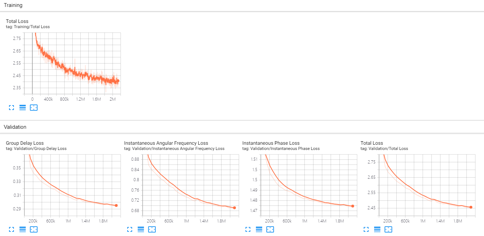

# Neural Speech Phase Prediction based on Parallel Estimation Architecture and Anti-Wrapping Losses
### Yang Ai, Zhen-Hua Ling

In our [paper](https://arxiv.org/xxx), 
we proposed a novel speech phase prediction model which predicts wrapped phase spectra directly from amplitude spectra by neural networks.<br/>
We provide our implementation and pretrained models as open source in this repository.

**Abstract :**
This paper presents a novel speech phase prediction model which predicts wrapped phase spectra directly from amplitude spectra by neural networks. The proposed model is a cascade of a residual convolutional network and a parallel estimation architecture. The parallel estimation architecture is composed of two parallel linear convolutional layers and a phase calculation formula, imitating the process of calculating the phase spectra from the real and imaginary parts of complex spectra and strictly restricting the predicted phase values to the principal value interval. To avoid the error expansion issue caused by phase wrapping, we design anti-wrapping training losses defined between the predicted phase spectra and natural ones by activating the instantaneous phase error, group delay error and instantaneous angular frequency error using an anti-wrapping function, respectively. Experimental results show that our proposed neural speech phase prediction model outperforms the iterative Griffin-Lim algorithm and other neural network-based method, in terms of both reconstructed speech quality and generation speed.

Visit our [demo website](http://staff.ustc.edu.cn/~yangai/NSPP/demo.html) for audio samples.

## Requirements
```
torch==1.8.1+cu111
numpy==1.21.6
librosa==0.9.1
tensorboard==2.8.0
soundfile==0.10.3
matplotlib==3.1.3
```

## Data Preparation
For training, write the list paths of training set and validation set to `input_training_wav_list` and `input_validation_wav_list` in `config.json`, respectively.

For generation, we provide two ways to read data:

(1) set `test_input_log_amp_dir` to `0` in `config.json` and write the test set waveform path to `test_input_wavs_dir` in `config.json`, the generation process will load the waveform, extract the log amplitude spectra, predict the phase spectra and reconstruct the waveform;

(2) set `test_input_log_amp_dir` to `1` in `config.json` and write the log amplitude spectra (size is `(n_fft/2+1)*frames`) path to `test_input_log_amp_dir` in `config.json`, the generation process will dierctly load the log amplitude spectra, predict the phase spectra and reconstruct the waveform.

## Training
Run using GPU:
```
CUDA_VISIBLE_DEVICES=0 python train.py
```
Using TensorBoard to monitor the training process:
```
tensorboard --logdir=cp_NSPP/logs
```
An example of the training and validation curves in the tensorboard:<br>


## Generation:
Write the checkpoint path to `checkpoint_file_load` in `config.json`.

Run using GPU:
```
CUDA_VISIBLE_DEVICES=0 python generation.py
```
Run using CPU:
```
CUDA_VISIBLE_DEVICES=CPU python generation.py
```

## Pre-trained model for VCTK dataset:
You can also use pretrained models we provide to reconstruct the speech of any speaker in the VCTK dataset.<br/>
[Download pretrained model](https://drive.google.com/drive/folders/1w8CkvQrYlJt7Am3P_-jDvNaScDEE6gm5?usp=sharing)<br/>
Download the pre-trained model, write the model path to `checkpoint_file_load` in `config.json`, and finally run the generation code. 
